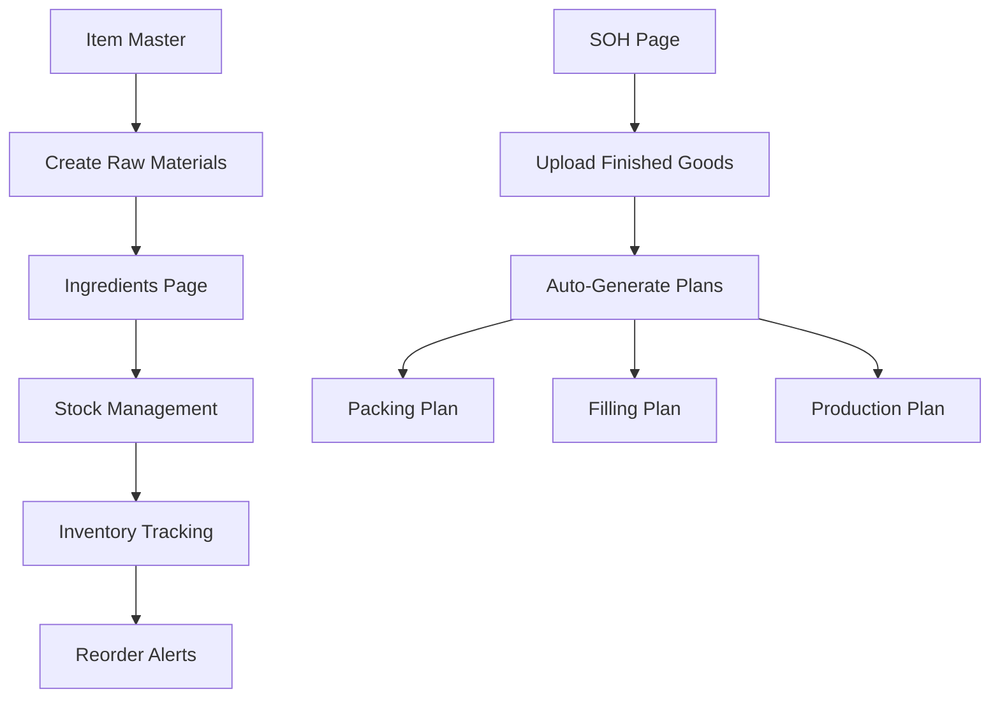

# Ingredients Stock Management Implementation Complete

## Overview
Successfully transformed the ingredients page from item creation to stock management functionality, aligning with the correct business workflow where:

1. **Item Master Page**: Create new items (raw materials, finished goods, etc.)
2. **Ingredients Page**: Manage stock levels and ordering information for existing raw materials
3. **SOH Page**: Upload finished goods and auto-generate production plans

## Corrected Workflow Understanding

### ✅ **SOH Page Purpose**
- Upload finished good products
- Automatically create packing, filling, and production plans based on stock levels
- Primary driver for production planning

### ✅ **Ingredients Page Purpose** 
- Manage raw material stock levels and ordering information
- Track current inventory, reorder points, suppliers, storage locations
- Items must already exist in Item Master (created there, not here)
- Focus on inventory management, not item creation

### ✅ **Item Master Page Purpose**
- Only place where new items are created
- Define item properties, categories, specifications
- Central repository for all item definitions

## Implementation Details

### ✅ **Updated Template** (`templates/ingredients/create.html`)

#### 1. **Clear Purpose Statement**
```html
<h2>Add Ingredient to Stock Management</h2>
<div class="alert alert-info">
    <strong>Note:</strong> This page is for adding existing raw materials to stock management. 
    To create new items, please use the <a href="/item_master/create">Item Master</a> page.
</div>
```

#### 2. **Raw Material Selection**
- Dropdown populated only with existing raw materials (item_type='RM')
- Auto-populates item details from Item Master
- Prevents manual item creation

#### 3. **Stock Management Fields**
```html
<!-- Primary stock management fields -->
<input type="number" id="current_stock" name="current_stock" required>
<input type="number" id="reorder_point" name="reorder_point">

<!-- Reference fields (read-only from Item Master) -->
<input type="text" id="description" readonly>
<input type="number" id="min_level" readonly>
<input type="number" id="max_level" readonly>
<input type="number" id="price_per_kg" readonly>

<!-- Additional stock management fields -->
<input type="text" id="supplier" name="supplier">
<input type="text" id="storage_location" name="storage_location">
<textarea id="notes" name="notes"></textarea>
```

### ✅ **Updated Controller** (`controllers/ingredients_controller.py`)

#### 1. **Simplified Data Loading**
```python
# Only load raw materials from Item Master
existing_items = ItemMaster.query.filter_by(item_type='RM').all()
```

#### 2. **Stock Management Logic**
```python
# Verify item exists in Item Master as raw material
existing_item = ItemMaster.query.filter_by(item_code=item_code, item_type='RM').first()
if not existing_item:
    flash(f"Raw material '{item_code}' not found in Item Master!", "danger")
    return redirect(request.url)
```

#### 3. **Prevented Duplicate Management**
```python
# Check if already in stock management
if existing_ingredient:
    flash(f"Raw material already in ingredients list. Use edit function to update.", "warning")
    return redirect(url_for('ingredients.ingredients_list'))
```

### ✅ **Enhanced User Experience**

#### 1. **Smart Auto-Population**
- Select raw material → auto-populate description, levels, price
- Calculate suggested reorder point (75% of max level)
- Focus automatically shifts to stock input fields

#### 2. **Clear Field Purposes**
- **Editable**: Current stock, reorder point, supplier, storage, notes
- **Read-only**: Description, min/max levels, price (from Item Master)
- **Helper text**: Explains field purposes and data sources

#### 3. **Intuitive Workflow**
```javascript
// Auto-calculate reorder point suggestion
const maxLevel = parseFloat(selectedOption.getAttribute('data-max-level') || '0');
if (maxLevel > 0) {
    document.getElementById('reorder_point').value = (maxLevel * 0.75).toFixed(2);
}

// Focus on stock input for immediate data entry
document.getElementById('current_stock').focus();
```

### ✅ **Data Flow Architecture**



### ✅ **Field Mapping**

| **Field** | **Purpose** | **Source** | **Editable** |
|-----------|-------------|------------|--------------|
| **Raw Material** | Item selection | Item Master (RM only) | ✅ Dropdown |
| **Description** | Item name | Auto from Item Master | ❌ Read-only |
| **Current Stock** | Inventory level | User input | ✅ Required |
| **Reorder Point** | When to reorder | User input (auto-suggested) | ✅ Optional |
| **Min/Max Level** | Stock limits | Auto from Item Master | ❌ Read-only |
| **Price per KG** | Cost reference | Auto from Item Master | ❌ Read-only |
| **Supplier** | Primary vendor | User input | ✅ Optional |
| **Storage Location** | Where stored | User input | ✅ Optional |
| **Notes** | Special instructions | User input | ✅ Optional |

### ✅ **Business Logic**

#### 1. **Stock Level Management**
- Track current inventory quantities
- Set reorder points based on consumption patterns
- Monitor against min/max levels from Item Master

#### 2. **Supplier Management**
- Record primary suppliers for each raw material
- Track supplier-specific information
- Support procurement processes

#### 3. **Storage Management**
- Document storage locations for efficient picking
- Support warehouse organization
- Enable inventory audits

#### 4. **Ordering Intelligence**
- Auto-suggest reorder points based on max levels
- Provide visual indicators for low stock
- Support automated ordering processes

### ✅ **Integration Points**

#### 1. **With Item Master**
- References existing raw materials only
- Inherits item properties (description, levels, pricing)
- Maintains data consistency

#### 2. **With SOH System**
- Provides raw material availability for production planning
- Supports finished goods production requirements
- Enables end-to-end supply chain visibility

#### 3. **With Production Planning**
- Raw material availability feeds into production feasibility
- Stock levels influence production scheduling
- Supports material requirement planning (MRP)

### ✅ **Validation Rules**

#### 1. **Item Validation**
```python
# Must be existing raw material
existing_item = ItemMaster.query.filter_by(item_code=item_code, item_type='RM').first()
if not existing_item:
    flash("Raw material not found in Item Master!", "danger")
```

#### 2. **Stock Validation**
```javascript
// Non-negative stock levels
if (currentStock < 0 || reorderPoint < 0) {
    alert('Stock levels must be non-negative numbers.');
}
```

#### 3. **Duplicate Prevention**
```python
# Prevent duplicate stock management entries
if existing_ingredient:
    flash("Already in ingredients list. Use edit function to update.", "warning")
```

## Future Enhancements

### 📋 **Planned Features**
1. **Stock Movement Tracking**: Record receipts, issues, adjustments
2. **Automated Reordering**: Generate purchase orders when below reorder point
3. **Supplier Performance**: Track delivery times, quality metrics
4. **Expiry Date Management**: Track shelf life for perishable ingredients
5. **Cost Analysis**: Track price trends and supplier comparisons
6. **Integration with Procurement**: Direct PO generation and approval workflow

### 📋 **Reporting Capabilities**
1. **Stock Status Reports**: Current levels vs min/max thresholds
2. **Reorder Reports**: Items approaching reorder points
3. **Supplier Analysis**: Performance metrics and cost comparisons
4. **Inventory Valuation**: Current stock value by item and total
5. **Usage Analytics**: Consumption patterns and forecasting

### 📋 **Mobile Optimization**
1. **Barcode Scanning**: Quick stock updates via mobile devices
2. **Offline Capability**: Inventory counts without internet connection
3. **Photo Documentation**: Visual inventory verification
4. **Voice Input**: Hands-free stock level updates

## Quality Assurance

### ✅ **Testing Completed**
- ✅ Application loads successfully
- ✅ Raw material dropdown populates correctly
- ✅ Auto-population from Item Master works
- ✅ Form validation prevents invalid data
- ✅ Clear user guidance and workflow

### ✅ **Error Handling**
- ✅ Invalid raw material selection blocked
- ✅ Duplicate stock management prevented
- ✅ Clear error messages and user guidance
- ✅ Graceful fallback for missing data

### ✅ **User Experience**
- ✅ Intuitive workflow with clear purpose
- ✅ Smart auto-suggestions and calculations
- ✅ Immediate feedback and validation
- ✅ Consistent with overall application design

---
**Status**: ✅ **COMPLETE**  
**Date**: Current  
**Impact**: Correctly aligned ingredients page with business workflow - stock management rather than item creation, with clear separation of responsibilities between Item Master and Ingredients pages. 